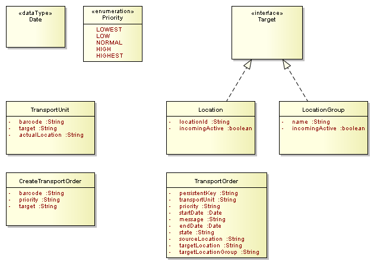

= OpenWMS.org TMS: RESTful API (Transportation Service)
({bversion}-{bnumber})
Heiko Scherrer;
:doctype: book
:icons: font
:toc:
:sectanchors:
:sectlinks:
:toclevels: 2
:source-highlighter: highlightjs

Copyright © 2005-2019

Copies of this document may be made for your own use and for distribution to others, provided that you do not charge any fee for such copies
and further provided that each copy contains this Copyright Notice, whether distributed in print or electronically.

[[overview]]
= Overview
This guide describes the RESTful API of the OpenWMS.org Transportation module and its usage. Some general terms and definitions
are explained and declared in the first part of the document whereas in the second part the usage of the API is shown in
a more use-case-driven approach.

[[overview-terms]]
== General Terms and Definitions
The next subsections are valid for all entity interactions described in the rest of this document.

[[overview-http-verbs]]
=== HTTP verbs
This RESTful API tries to adhere as closely as possible to standard HTTP and REST conventions in its
use of HTTP verbs.

|===
| Verb | Usage | Idempotent

| `GET`
| Used to retrieve a resource
| `yes`

| `POST`
| Used to create a new - not existing - resource (although called transient resource)
| `yes`

| `PUT`
| Used to update an existing resource, including the whole resource in the request body (the resource is called a
detached resource)
| `yes`

| `PATCH`
| Used to update an existing resource, including partial updates (the resource to update is called a managed resource)
| `no`

| `DELETE`
| Used to delete an existing resource
| `no`
|===

[[overview-http-status-codes]]
=== HTTP status codes
This RESTful API tries to adhere as closely as possible to standard HTTP and REST conventions in its
use of HTTP status codes.

|===
| Status code | Usage

| `200 OK`
| The request completed successfully. http://tools.ietf.org/html/rfc7231#section-6.3.1[Details]

| `201 Created`
| A new/transient resource has been created successfully. The resource's URI is available from the response's
`Location` header. http://tools.ietf.org/html/rfc7231#section-6.3.2[Details]

| `204 No Content`
| An update to an existing resource has been applied successfully. http://tools.ietf.org/html/rfc7231#section-6.3.5[Details]

| `400 Bad Request`
| The request was malformed. The response body will include an error providing further information. http://tools.ietf.org/html/rfc7235#section-3.1[Details]

| `403 Forbidden`
| The requested resource was forbidden to be accessed by the currently authenticated user. http://tools.ietf.org/html/rfc7231#section-6.5.3[Details]

| `404 Not Found`
| The requested resource did not exist. http://tools.ietf.org/html/rfc7231#section-6.5.5[Details]

| `409 Conflict`
| Indicates that the request could not be completed due to a conflict with the current state of the target resource. http://tools.ietf.org/html/rfc7231#section-6.5.8[Details]
|===

[[overview-hypermedia]]
=== Hypermedia
TMS Transportation uses hypermedia links where resources include links to other resources.
Responses are in http://stateless.co/hal_specification.html[Hypertext Application
Language (HAL)] format. These hyperlinks belong to the technical part of the resource representation
and are grouped with the `_links` element. Users of the API should not create URIs themselves,
and use hyperlinkes for navigation only.

[[resources]]
= Resources
The domain model of the RESTful API consists of a couple of classes with simple datatypes and no explicit relationships between each
other. One special implicit type is the `Date` type that defines the default date format if not otherwise requested by the consuming
service.

[[resources-to]]
== TransportOrder
The main resource of the TMS Transportation module is the `TransportOrder`. A `TransportOrder` is used in automated warehouses to move `TransportUnits`
between `Locations`. Automated warehouses means a Material Flow Controller (MFC, see (Material Flow)[https://en.wikipedia.org/wiki/Material_flow]) uses
`TransportOrders` to route and track the movements within the warehouse. In manual warehouse OpenWMS.org uses `Movements` to track this in a manually.

The attributes of the `TransportOrder` representation:
 
|===
| Attribute | Description

| `persistentKey`
| A synthetic unique key that identifies `TransportOrder`. May be replaced with self-links in future.

| `transportUnitId`
| The unique identifier of the TransportUnit that is carried. May be replaced with a link in future.

| `priority`
| The priority of the `TransportOrder` is used to control the order of execution.

| `startDate`
| The timestamp when the `TransportOrder` has been started.

| `message`
| The last error message occurred according to the `TransportOrder`.

| `endDate`
| The timestamp when the `TransportOrder` has been ended.

| `state`
| The current state of the `TransportOrder`.

| `sourceLocation`
| The `Location` taken from the `TransportUnit` where the `TransportOrder` has been started.

| `targetLocation`
| The `Location` as destination of the `TransportUnit`.

| `targetLocationGroup`
| The `LocationGroup` as destination of the `TransportUnit`.
|===
 

[[interaction-model]]
= Interaction Model

[[resources-to-create]]
== Create a new TransportOrder
At least the `Barcode` of the `TransportUnit` that needs to be moved and the `Target` destination must be given to create a new `TransportOrder`.
In this example we also pass the `Priority` of the `TransportOrder` in order to control the priority of execution. `TransportOrders` with a high
priority might be started and executed before those with lower priority.

=== Request to move a TransportUnit to a Location
In this example we pass a `Location` string as `Target`. An unique identifier of a `LocationGroup` is accepted as well.

include::{generated}/to-create/curl-request.adoc[]

If the `TransportOrder` has been created successfully, the server responds with http status code `201` and returns the URI of the created
`TransportOrder` in the `LOCATION` header.

=== Response if created

include::{generated}/to-create/http-response.adoc[]

The URI can be used to lookup the created `TransportOrder` by it's persistent key. A `GET` request would look like this:

=== Lookup the created TransportOrder

include::{generated}/to-create-and-get/curl-request.adoc[]

and the server returns the representation of the created `TransportOrder`

include::{generated}/to-create-and-get/http-response.adoc[]

=== Fails to create a TransportOrder
The creation of a `TransportOrder` may fail for several reasons. At first the `TransportUnit` with the given `Barcode` may not exist.
Or the `Target` destination is unknown. In both cases the server responds with a http status code `404` (Not Found):

include::{generated}/to-create-uk-to/http-response.adoc[]

== Changing TransportOrders
Created `TransportOrders` can be changed. The system allows to redirect or prioritize them under certain circumstances.
For example redirection might only be possible if the `TransportOrder` did not already reached the final `Target` destination
and is still active. Or prioritization is only allowed with well-known values for the `Priority`. 

=== Redirect to a new Target
Existing and active `TransportOrders` can be redirected to a new `Target`. This redirection happens through an `PATCH` request
where the API expects the partial representation of the `TransportOrder` as request body. Here an example request to redirect the
`TransportOrder` with the given persistent key to a new `Target`.

include::{generated}/to-patch-target-blocked-loc/curl-request.adoc[]

=== Change Priority
Changing the `Priority` of an `TransportOrder` is also requested with a `PATCH` request. The follow example shows a request
to lower the `Priority` of an existing `TransportOrder`, identified by the given persistent key, to `NORMAL`.
Notice that the `TransportOrder` does not need to be started yet.

include::{generated}/to-patch-priority-ok/curl-request.adoc[]

If the request has been executed successfully, the server responds with a http status code `204`

include::{generated}/to-patch-priority-ok/http-response.adoc[]

If the server does not accept the passed `Priority` level the response status is `400` (Bad Request),

include::{generated}/to-patch-priority-with-null/http-response.adoc[]
